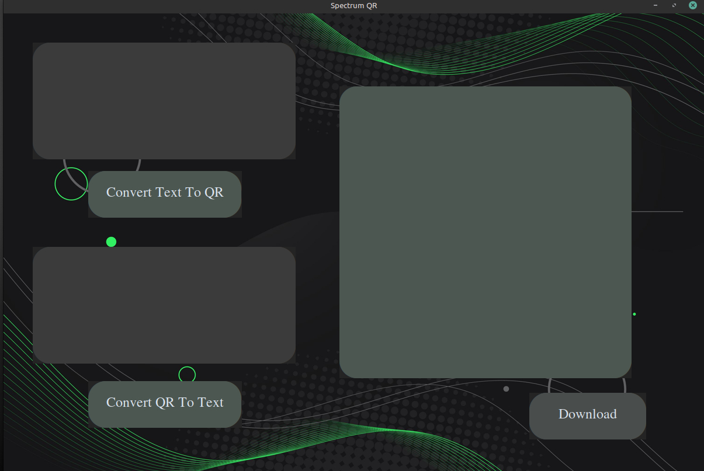
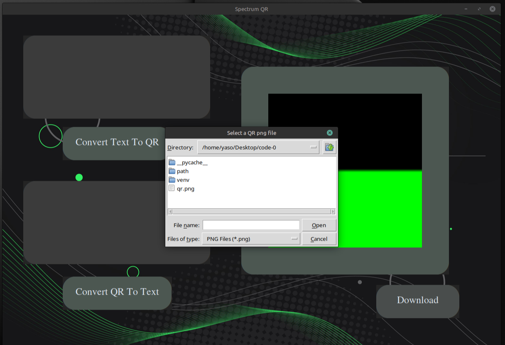
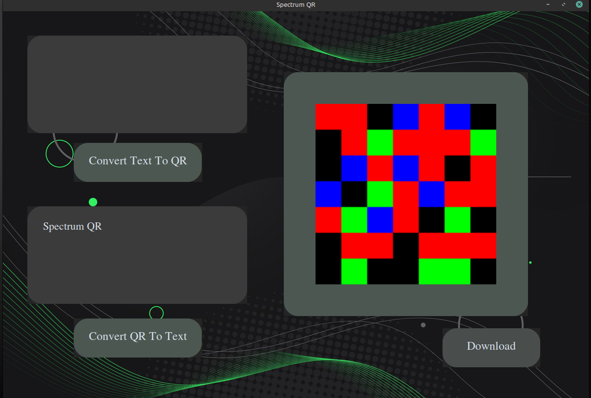
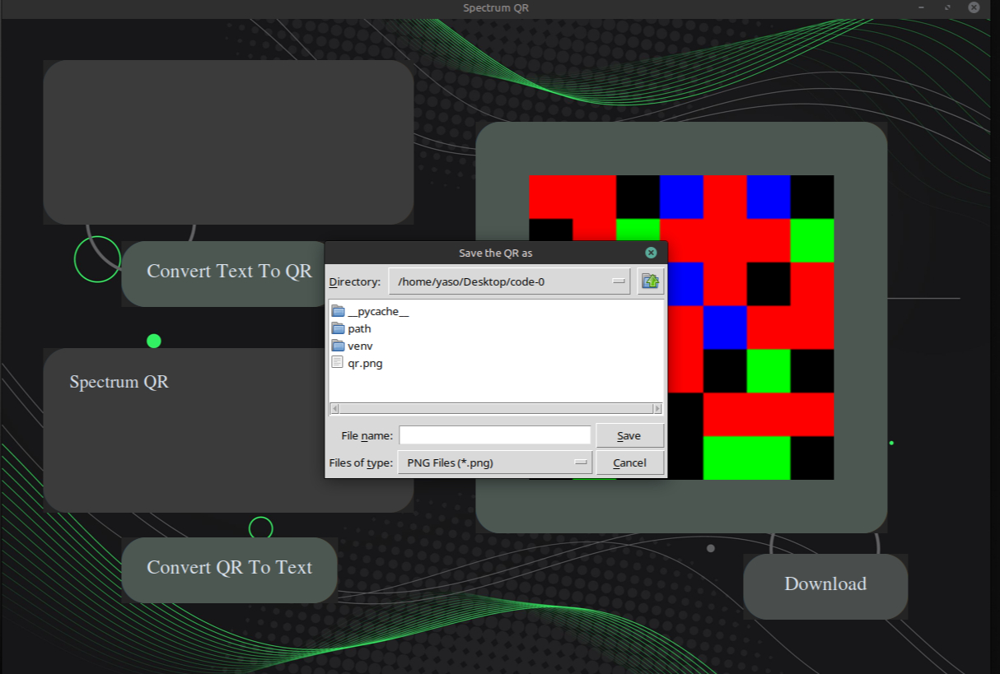
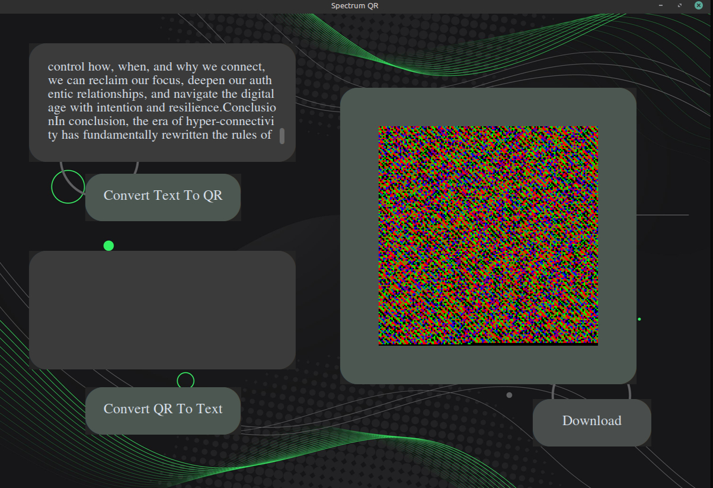
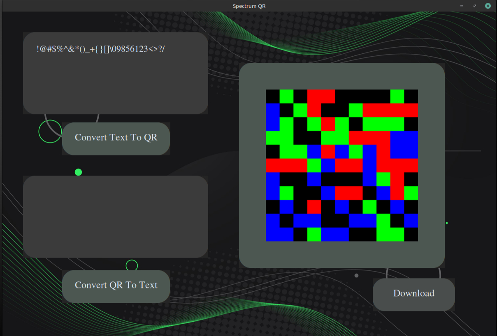
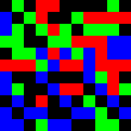

# Spectrum-QR
An experimental color-based QR-like encoding system using multistate RGB modules for higher-density visual data storage.

## Preview




## How It Works

The encoder converts text into UTF-8 bytes, transforms the bytes into binary, splits the binary stream into 2-bit chunks, and maps each chunk to a unique RGB color state.

Pipeline:

Text
→ UTF-8
→ Binary
→ 2-bit chunks
→ Numerical states
→ RGB matrix
→ PNG image

## Color Mapping

| Bits | Value | Color |
|------|------|------|
| 00 | 0 | Black |
| 01 | 1 | Red |
| 10 | 2 | Green |
| 11 | 3 | Blue |

##Features

### The app:


### The app supports text input and converts into QR:


### When clicked on QR to Text Button it prompts the user to select a PNG file of the QR:



### After selecting the desired PNG it converts it to text :



### When the download button is clicked the user is prompted to select their desired destination to save the png file:



### The app allows large amounts of text to be converted into spectrum QR; this is an example of 1000-word essay:



### The app allow the use of various symbols:


### The downloaded QR image:



## Installation

```bash
pip install numpy pillow customtkinter
```

## Usage

```bash
run.py
```
## Project Status

Version 1 prototype completed.

Current implementation supports PNG-based encoding and decoding under controlled conditions.

## Planned Features

- OpenCV live scanning
- Orientation markers
- Perspective correction
- Error correction
- Real-time decoding


